# Module1 Tutorial

## What we will accomplish

In Module 1, you will start by using the Open XML SDK Productivity Tool. This reflects C# code from a template document provided in the Assets folder. This provides the base from which customizations can be made. 

We will then add that reflected code to a C# .Net Core project and test it to make sure it generates the same workbook we started with.

## Reflect code to build our report programmatically

1. From the start menu, run the Open XML SDK Productivity Tool:

    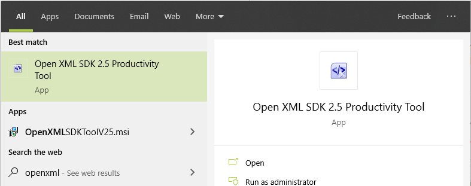

1. And open the example report workbook from which we'll build our code:

    `Assets\ExampleReport.xlsx`

    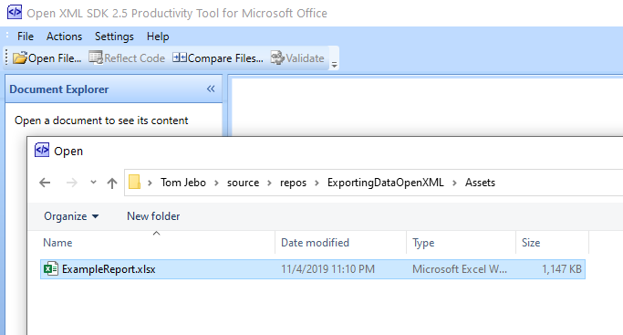

1. On the toolbar, select "Reflect Code":

    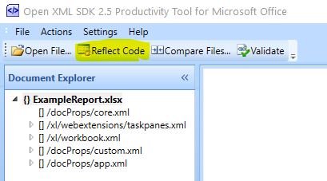

1. You should now see the reflected C# code in the "Reflected Code" tab: 

    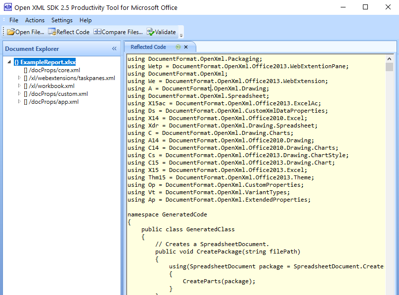

    Keep the tool window open and move to the next section.


## Setup the project for Open XML SDK use

1. Open the base project in Visual Studio by opening the solution:

    `PracticeSolution\reportgenerator\reportgenerator.sln`

1. Once Visual Studio opens the project, go to the Nuget package manager:

    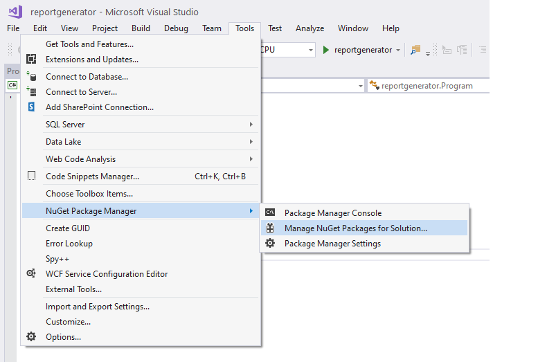

1. Browse by searching for "documentformat" and install the latest stable package:

    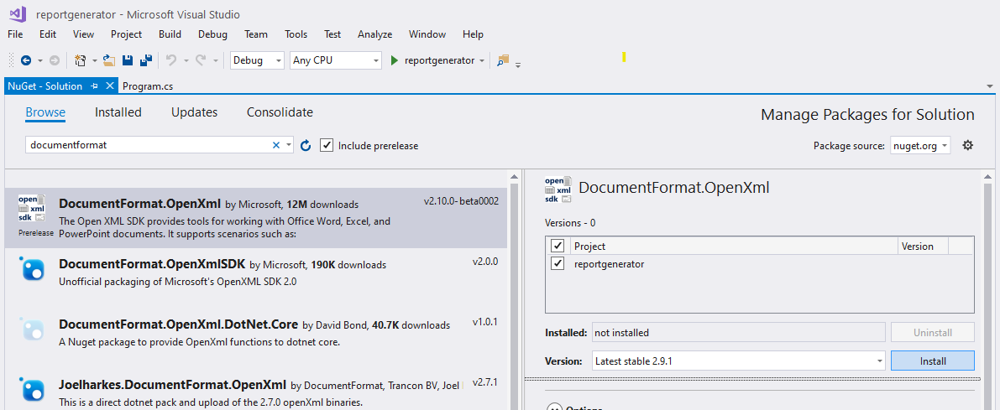

    Click "OK" and "I Accept" on next two dialogs to install the package.

## Add the reflected code to our project

1. Add a new item to the `reportgenerator` project and choose C# module:

    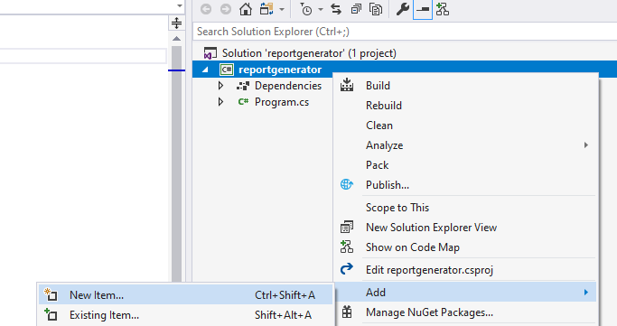

1. Name the new item:

    `Generator.cs`

    Like this:

    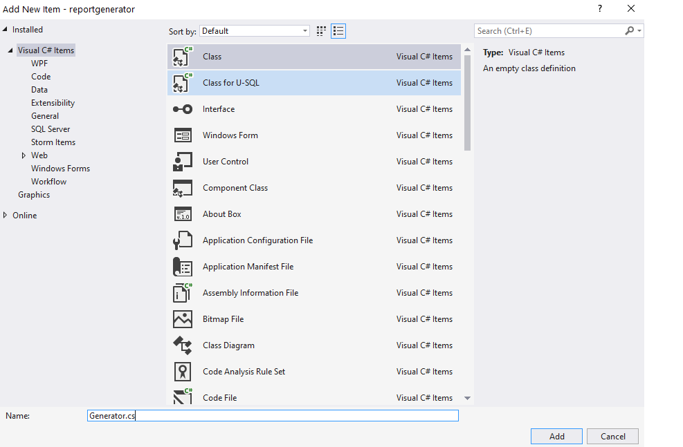

1. Open Generator.cs for editing.

1. Select everything but the `using` statements like this:

    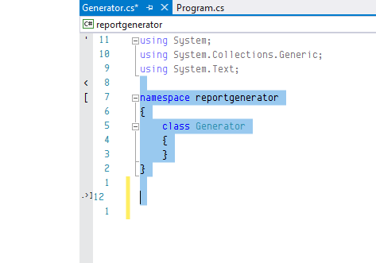

1. Back in the Open XML SDK Productivity Tool, copy the reflected code:

   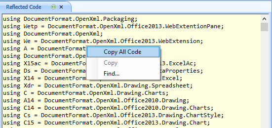

1. In Visual Studio, paste to replace the selected code so it looks like this: 

   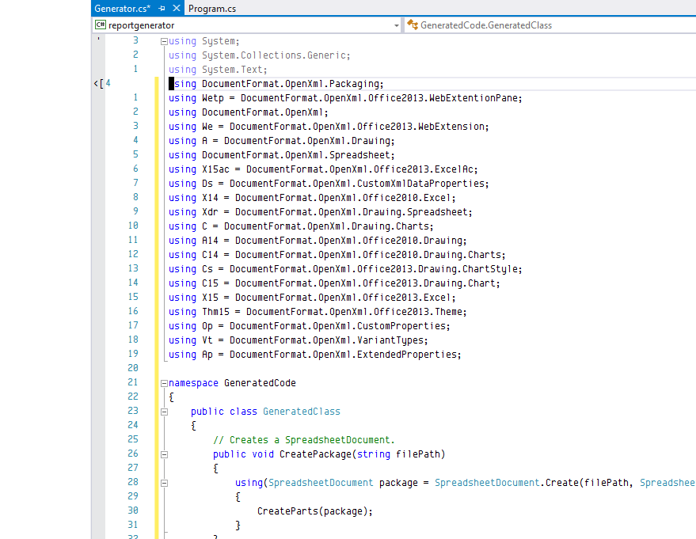

1. Replace the following line:

    ```csharp
    namespace GeneratedCode
    ```

    With:

    ```csharp
    namespace reportgenerator`
    ```

1. And replace:

    ```csharp
    public class GeneratedClass
    ```

    With:

    ```csharp
    public class Generator
    ```

1. Then in `Main` function back in `Program.cs`, replace:

    ```csharp
    Console.WriteLine("Hello World!");
    ```

    With:

    ```csharp
    Generator g = new Generator();
    g.CreatePackage(args[0]);
    Console.ReadLine();
    ```

1. The code in `Program.cs` should look like this: 

    ```csharp
    using System;

    namespace reportgenerator
    {
        class Program
        {
            static void Main(string[] args)
            {
                Generator g = new Generator();
                g.CreatePackage(args[0]);
                Console.ReadLine();
            }
        }
    }
    ```

1. Hit `Ctrl-Shift-b` to build the solution and make sure there are no errors.

1. Open `Project | Properties`

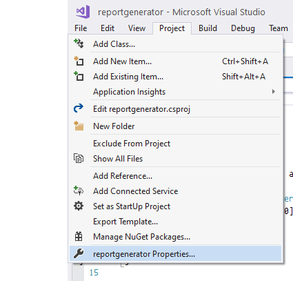

1. In the Debug tab, add the following string to `Application arguments:`

    `$(SolutionDir)TestReport.xlsx`

    So it looks like this:

    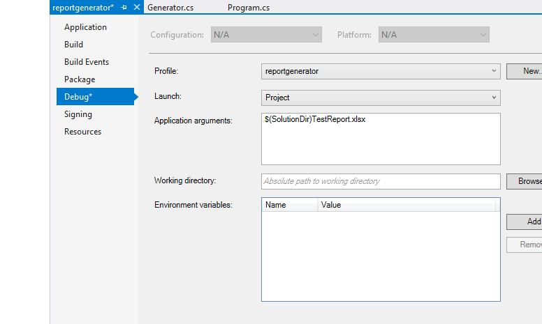

1. Now if you run the project in debug using `Ctrl-F5`, you will see the console windows appear and stay until you hit `Enter`. In the solution directory, you will see the following file:

    `PracticeSolution\reportgenerator\TestReport.xlsx`

1. Open the workbook with Excel to make sure the `Focus Task Data` worksheet looks like this:

    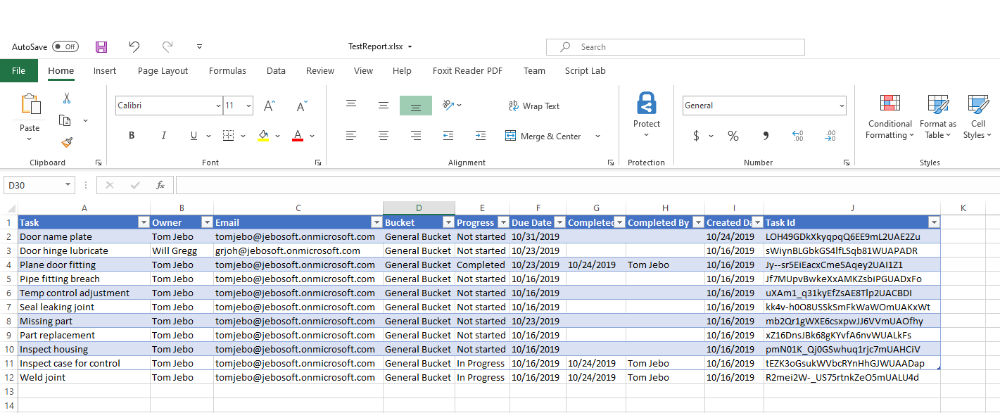

## Summary

You now have a code base which generates a template workbook. This will allow you to customize the report and make it data driven. 

Next step, go to [Module 2](Module2.md) and follow the tutorial to create your data driven sheet generator.

