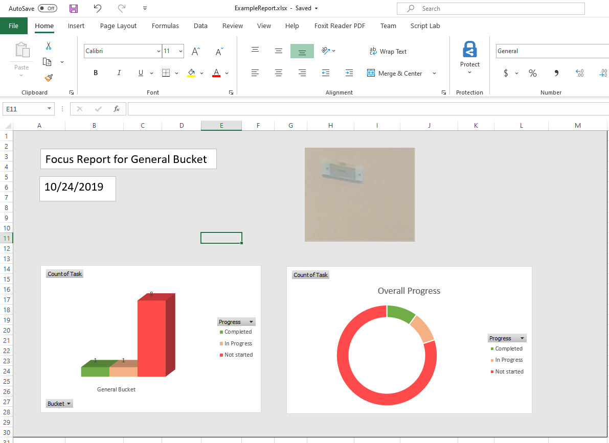

# Module1 Tutorial

## What we will accomplish

In Module 1, you will start by using the Open XML SDK Productivity Tool. This reflects C# code from a template document provided in the Assets folder. This provides the base from which customizations can be made.

## Prerequisites

- Office account tenant for your team
- Visual Studio (Community is fine)
- Git command line tools
- Web browser (Chrome or Edge are fine)
- Open XML SDK Productivity Tool
- Open XML SDK from nuget.org

## Get started

1. Start by cloning this whole repository to your local system so you have all the data files, example reports, folders and working solution for reference.

    `git clone https://github.com/InteropEvents/ExportingDataOpenXML.git`

2. Go to the Tools folder in the repo and run:

    `Tools\OpenXMLSDKToolV25.msi`

   This will install the Open XML SDK Productivity Tool used in Module 1.

## Follow the tutorial

1. Now you are ready to follow the tutorial. Start with [Module 1](module1.md), which walks you through generating the Microsoft Graph data and the initial C# Open XML SDK project.

1. Complete the main tutorial by following [Module 2](module2.md). This will lead you through customizing the code to use the Microsoft Graph data to build the worksheet table.

1. If you have time, follow the [Advanced Module](advancedmodule.md) to generate web extension parts which will pin or autoload the Excel add-in to this tutorial's workbook.
