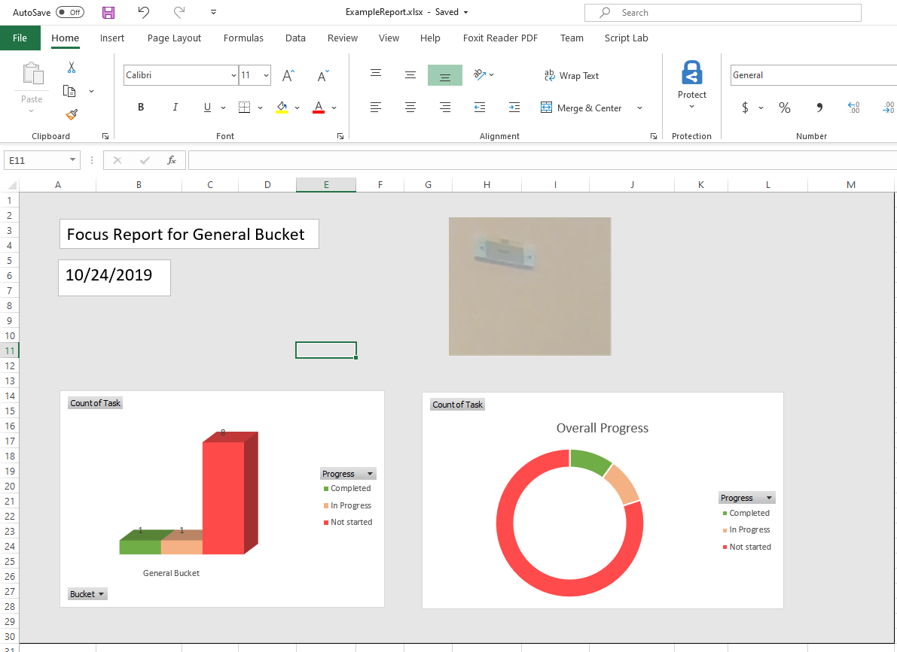
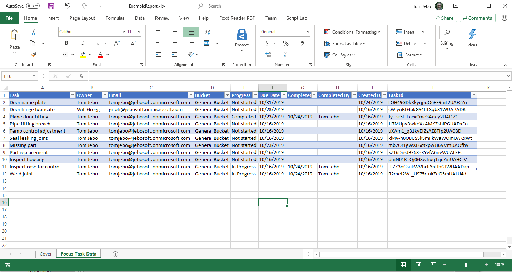
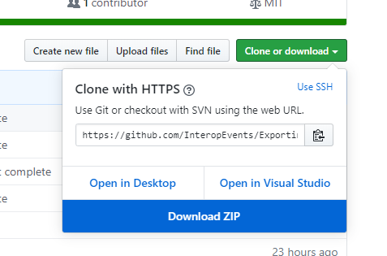

# Microsoft 365 DevDays ExportingDataOpenXML Workshop

## Contents

- [Exporting Data using Microsoft Graph, OXML, and SDK Office Add-ins](#exporting-data-using-microsoft-graph,-oxml,-and-sdk-office-add-ins)
- [What the code does](#what-the-code-does)
- [Prerequisites](#prerequisites)
- [Get started](#get-started)
- [Follow the tutorial](#follow-the-tutorial)

## Exporting Data using Microsoft Graph, OXML, and SDK Office Add-ins

In this repo you'll find steps to create an application which generates an Excel workbook, modify the application to drive the worksheet generation by data and pin an Excel add-in to that workbook.

## What the code does

The code is generated initially by the Open XML SDK Productivity Tool. This reflects C# code from a template document. This provides the base from which customizations can be made.

The worksheet generation is modified using snippets in this tutorial to build a table from Microsoft Graph generated JSON data.

Finally, the worksheet generation code is modified to "pin" (auto open) an Excel JS add-in to the workbook.

## Prerequisites

- Office account tenant for your team
- Visual Studio (Community is fine)
    - NOTE: Install the [following workloads](Assets/vsinstallworkloads.png) for VS: 
        - .Net desktop development
        - Office/Sharepoint development
        - .Net Core cross-platform development
- Git command line tools
- Web browser (Chrome or Edge are fine)
- Open XML SDK Productivity Tool
- Open XML SDK from nuget.org

## Get started

1. Start by cloning this whole repository to your local system so you have all the data files, example reports, folders and working solution for reference.  Use the Github `Clone or download` button to copy the URL and then issue this command:

    `git clone https://github.com/InteropEvents/ExportingDataOpenXML.git`

1. Or, alternatively, download the zip file using the Github `Clone or download` button:

    

1. Go to the Tools folder in the repo and run:

    `Tools\OpenXMLSDKToolV25.msi`

   This will install the Open XML SDK Productivity Tool used in Module 1.

## Follow the tutorial

1. Now you are ready to follow the tutorial. Start with [Module 1](Module1.md), which walks you through generating the Microsoft Graph data and the initial C# Open XML SDK project.

1. Complete the main tutorial by following [Module 2](Module2.md). This will lead you through customizing the code to use the Microsoft Graph data to build the worksheet table.

1. If you have time, follow the [Advanced Module](AdvancedModule.md) to generate web extension parts which will pin or autoload the Excel add-in to this tutorial's workbook.
